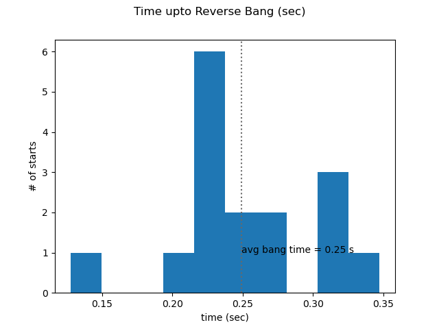
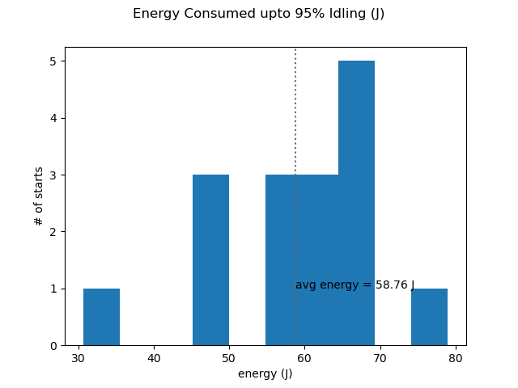

=========
Firetrace
=========

Firetraces are traces of engine starts taken with sparkplug. 

.. code-block:: python

    {
    "sym_file" : "Symbol_file_isg_assist_codebase.sym",
    "trace_file" : "v13_working_more_clean_cranks.trc",
    "vertical_speed_jump" : 550,
    "jump_time_duration" : 0.03,
    "idling_speed" : 1500,
    "m_speed" : "Bemf_Speed_RPM",
    "operation_mode" : "MEAS_OPMODE",
    "battery_current" : "IDC_Estimated",
    "battery_voltage" : "Vbat",
    "u_theta" : "MEAS_UTHETA"
    }

Example set of config, trace, and ``.sym`` files are `config.json <_static/files/firetrace/fireconfig.json>`_, `trace.trc <_static/files/firetrace/firetrace.trc>`_ and `symbol.sym <_static/files/Symbol_file_isg_assist_codebase.sym>`_. 
Command below is used to analyse firetrace taken from PCAN. 

.. code-block:: bash

    isg.firetrace --config config.json

Description of config.json file:

* "sym_file" : Name of PCAN ``.sym`` file
* "trace_file" : Name of ``.trc`` file
* "speed_jump" : Speed jump in RPM at fire point. Motor-engine specific. 
* "jump_time_duration" : Time in seconds required to achieve "vertical_speed_jump" at fire point. 
* "m_speed" : Speed variable name in ``.sym`` file
* "operation_mode" : Op_mode variable name in ``.sym`` file
* "battery_current" : Ibat variable name in ``.sym`` file
* "battery_voltage" : Vbat variable name in ``.sym`` file
* "u_theta" : U_theta variable name in ``.sym`` file

Description of script:

* Successful cranks detection based on op__mode 
* For each successful crank 

    * Calculate reverse bang time based on utheta 
    * Engine-fire-time based on jump in speed

* Jump detection requires engine-motor specific parameter ``speed_jump``. 550 RPM in 0.03 seconds is for NTorq. 
* The value of ``jump_time_duration`` should be increased if m_speed data transmits are sparse.

Figure outputs are saved in folder named ``isg_plots`` created at terminal location. 
A sample subset of the figures is shown below.

Text-output is written in ``firetrace_output.csv`` file at terminal location.

